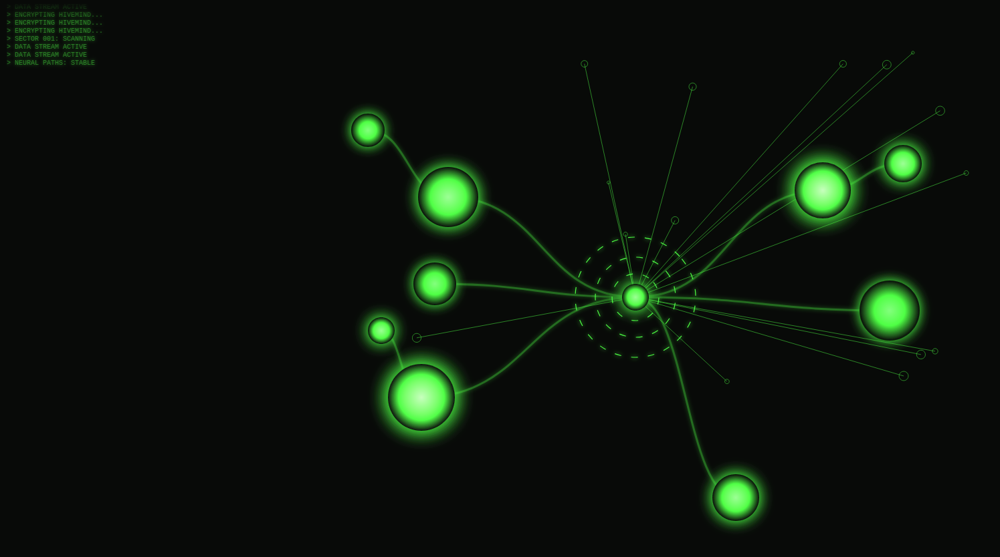

# 🟢 Borg Neural Tree Interface / borg-html-sdk

Borg HTML interface SDK / template

Live preview: <https://jblond.github.io/borg-html-sdk/>



A high-performance, interactive neural network interface in the style of the Borg Collective. 
This project visualizes a hierarchical tree structure (neural tree) with flowing data streams, 
recursive path highlighting, and atmospheric background effects.

## 🚀 Features

- **Dynamic Tree Structure:** Allows nodes to be attached to other nodes (`parentId`) to form complex neural clusters.
- **Recursive Highlighting:** When hovering over a node, the entire path cascades to the center.
- **Real-Time Data Pulses:** Animated SVG pulses flow organically along the calculated curves (Bézier paths).
- **Atmospheric Effects:**
- **Radar Sweep:** A periodic scan effect radiating from the center.
- **Ghost Layer:** Subtle background noise from inactive nodes for visual depth.
- **Status Log:** A simulated terminal stream for Hive messages.
- **Interactive Info Panels:** Clickable nodes open HUD windows with detailed information.

## Short Keys

- `m` mute sound
- `f` fire all burst

## ⚙️ Configuration

The network can be easily extended via the `config` object in the JavaScript section:

```javascript
const config = {
    center: { id: "core", x: 500, y: 400 },
    nodes: [
        { 
            id: "alpha", 
            x: 250, 
            y: 300, 
            r: 40, 
            blink: 'blink-1', 
            title: "Nexus Alpha", 
            text: "Zentraler Rechenknoten.",
	        closetext: 'custom text', // optional
	        shortcut: "6" // optional short cut key
        },
        { 
            id: "sub1", 
            parentId: "alpha", // Link to  Parent-Node
            x: 100, 
            y: 150, 
            r: 25, 
            blink: 'blink-2' 
        }
    ]
};
```
🧠 Technical Details

- Graphics: Scalable vector graphics (SVG) for lossless rendering.
- Animations: Combination of CSS keyframes and SVG animateMotion.
- Logic: Recursive JavaScript functions for path tracking.
- Design: Purist Borg green with glow filters and semi-transparent overlays.

> "Resistance is futile. The biological and technological characteristics will be added to ours."
